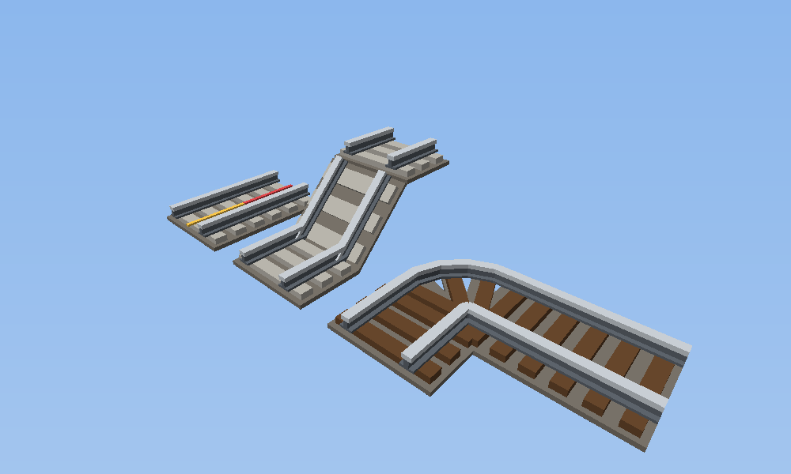
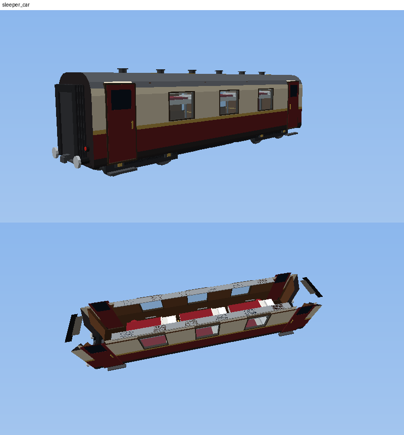

# Rail Express — mod de trains pour Minecraft 1.21.11 (Fabric)

Locomotives à vapeur, TGV, Shinkansen, voies à grande vitesse électrifiées, gares, attelages,
pupitre de conduite et affichage tête haute. **Tout se fabrique en survie.**

## Installation

1. Installer [Fabric Loader](https://fabricmc.net/use/) ≥ 0.19.5 pour Minecraft **1.21.11** et [Fabric API](https://modrinth.com/mod/fabric-api).
2. Compiler le mod : `./gradlew build` (Gradle doit tourner avec Java 25 ; le mod cible Java 21). Le fichier se trouve dans `build/libs/rail-express-1.0.0.jar`.
3. Copier le `.jar` dans le dossier `mods`.

Pour tester directement : `./gradlew runClient`.

## Véhicules (37)

**Locomotives** : vapeur, Orient-Express (Pacific bleu nuit et or), diesel (carburant ou charbon),
électrique BB (deux cabines), TGV bleu, TGV orange, Eurostar, ICE, Shinkansen.

**Voitures voyageurs** : voiture classique, voiture-couchettes (dortoir), voiture-restaurant (cantine),
voiture salon (repos), 1re classe de luxe, voiture panoramique, fourgon à bagages, voiture postale,
voiture-lits / restaurant / salon / fourgon Orient-Express, voitures TGV, voiture-bar TGV, TGV Duplex (deux niveaux),
TGV orange, Eurostar, ICE, Shinkansen et voiture verte Shinkansen.

**Marchandises** : tender, wagon couvert, citerne, trémie, porte-conteneurs, grumes, bestiaux, fourgon de queue.

## Réseau ferroviaire dans le monde

Dans les nouveaux mondes (ou nouveaux chunks), un réseau est généré automatiquement :
- des **lignes à grande vitesse** rectilignes tous les 512 blocs, nord-sud et est-ouest, toutes à la même altitude
  (y = 70) : **viaducs** au-dessus des vallées et de la mer, **tunnels** éclairés dans le relief ;
- environ une ligne sur deux est **électrifiée** (caténaires et sous-stations intégrées) ;
- à chaque intersection : un **croisement** réglable (tout droit / gauche / droite) et un poste d'aiguillage ;
- une **halte** avec quais, marquises et bâtiment voyageurs au milieu de chaque tronçon ;
- une **gare de village** reliée par un embranchement à la ligne la plus proche.

## Intérieurs

- Toute la caisse est cliquable et solide : on marche sur le plancher, entre les parois (sur une voie droite).
- **Portes** : clic droit sur une porte pour l'ouvrir ou la fermer (elles se ferment au départ du train).
- **Sièges, fauteuils, canapés, tabourets** : clic droit sur la place voulue pour s'y asseoir.
- **Couchettes** : s'allonger la nuit ; quand tous les joueurs dorment, le jour se lève.
- **Rangements** (porte-bagages, étagères, cuisine, casiers) : clic droit pour ouvrir le stockage du wagon.
- **Pupitre de conduite** des locomotives : clic droit dessus, ou touche *Inventaire* une fois assis.
- Les joueurs debout dans un wagon sont transportés avec le train (assis, c'est plus confortable à grande vitesse).
- **Animaux** : clic droit sur le wagon à bestiaux avec des animaux en laisse pour les embarquer.

## Recettes (survie)

Acier : fondre un lingot de fer au **haut fourneau** (ou au four, plus lent).

| Objet | Recette (lignes de la table de craft) |
|---|---|
| Essieu ×2 | `_A_ / AFA / _A_` (A = acier, F = lingot de fer) |
| Chaudière | `AAA / AxA / AsA` (x = four, s = seau) |
| Moteur électrique | `CRC / AFA / CRC` (C = cuivre, R = redstone) |
| Pantographe | `CCC / _A_ / A_A` |
| Siège ×2 | `L__ / LLL / A_A` (L = laine) |
| Outil d'attelage | `_A_ / AlA / _A_` (l = laisse) |
| Voie ferrée ×16 | `A_A / APA / A_A` (P = pierre) |
| Voie LGV ×12 | `A_A / ApA / A_A` (p = pierre lisse) |
| Voie électrifiée ×6 | `VCV / VRV / VCV` (V = voie LGV) |
| Voie de gare ×6 | `VPV / VRV / VPV` (V = voie ferrée, P = plaque de pression lourde) |
| Sous-station | `ACA / CBC / ACA` (B = bloc de redstone) |
| Locomotive à vapeur | `__b / KKA / EEE` (b = barreaux de fer, K = chaudière, E = essieu) |
| Tender | `AcA / AcA / E_E` (c = coffre) |
| Voiture voyageurs | `PvP / SSS / E_E` (P = planches, v = vitre, S = siège) |
| Wagon de marchandises | `PPP / PcP / E_E` |
| Motrice TGV | `vpB / MAM / E_E` (p = pantographe, B = béton bleu, M = moteur) |
| Voiture TGV | `BvB / SSS / E_E` |
| Motrice Shinkansen | `vpW / MAM / E_E` (W = béton blanc) |
| Voiture Shinkansen | `WvW / SSS / E_E` |

Toutes les recettes des nouveaux véhicules sont visibles dans le livre de recettes du jeu (essieux, sièges, moteurs, pantographes, chaudières, béton coloré…).

## Développement

- `tools/generate_textures.py` : génère les textures des blocs et objets.
- `tools/generate_data.py` : génère états de blocs, modèles, recettes, butins et tags.
- Mappings officiels Mojang, Fabric Loom 1.18, Fabric API 0.141.6+1.21.11.
