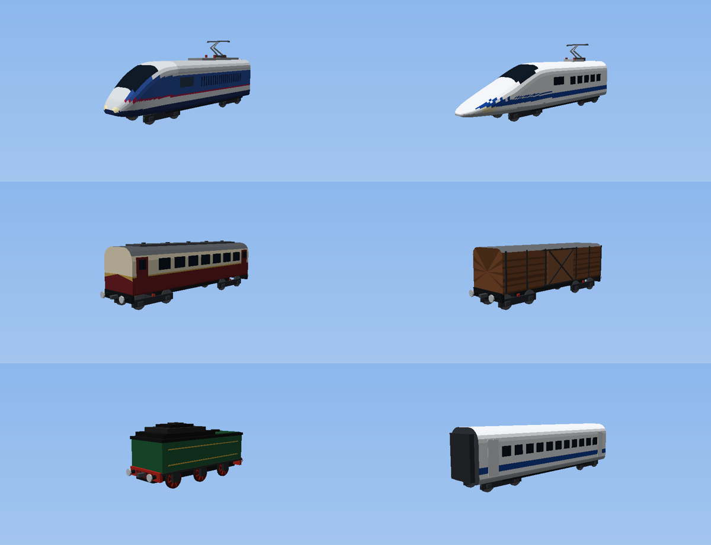
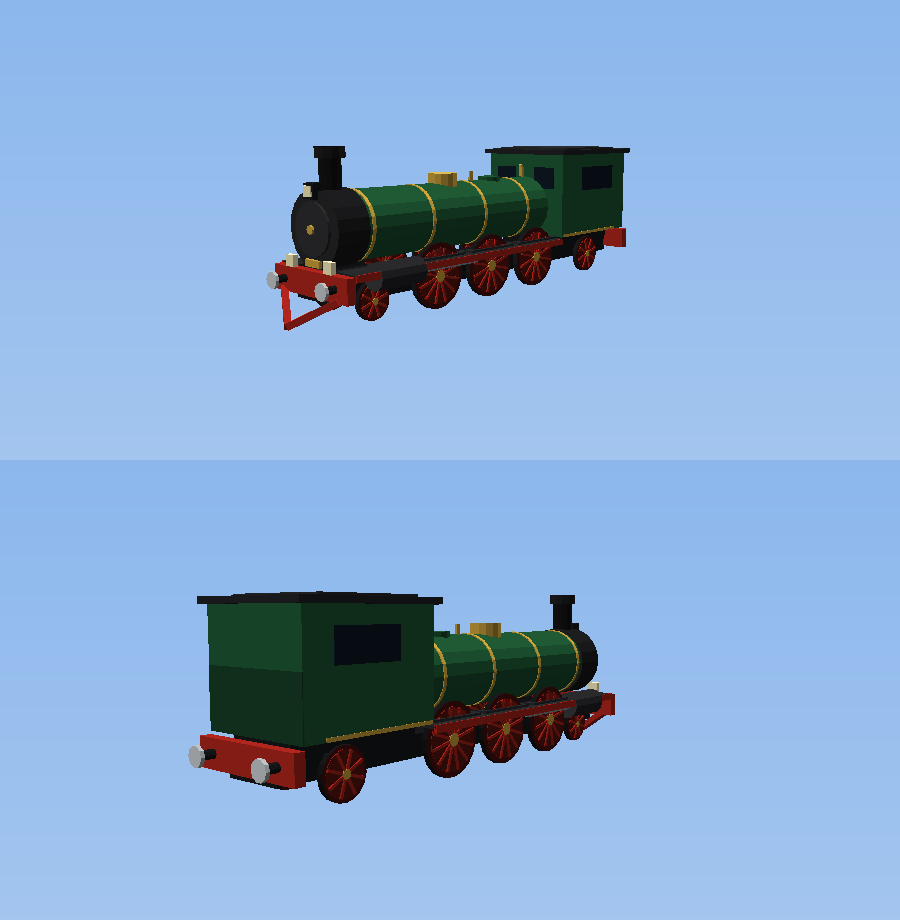

# Rail Express — mod de trains pour Minecraft 1.21.11 (Fabric)

Locomotives à vapeur, TGV, Shinkansen, voies à grande vitesse électrifiées, gares, attelages,
pupitre de conduite et affichage tête haute. **Tout se fabrique en survie.**

## Installation

1. Installer [Fabric Loader](https://fabricmc.net/use/) ≥ 0.19.5 pour Minecraft **1.21.11** et [Fabric API](https://modrinth.com/mod/fabric-api).
2. Compiler le mod : `./gradlew build` (Java 21). Le fichier se trouve dans `build/libs/rail-express-1.0.0.jar`.
3. Copier le `.jar` dans le dossier `mods`.

Pour tester directement : `./gradlew runClient`.

## Véhicules

| Véhicule | Énergie | Vitesse max. | Particularités |
|---|---|---|---|
| Locomotive à vapeur | Charbon / charbon de bois / bloc de charbon | 90 km/h | Fumée, bielles animées, sifflet |
| Tender à charbon | — | — | 9 emplacements, alimente la locomotive attelée |
| Voiture voyageurs | — | — | 8 places assises |
| Wagon de marchandises | — | — | 27 emplacements (comme un coffre) |
| Motrice TGV | Électricité (caténaire) | 180 km/h | Pantographe avec étincelles |
| Voiture TGV | — | — | 10 places |
| Motrice Shinkansen (N700) | Électricité (caténaire) | 198 km/h | Nez « bec de canard » |
| Voiture Shinkansen | — | — | 10 places |

Les modèles 3D sont générés procéduralement (nez aérodynamiques lissés, roues qui tournent,
bielles de la vapeur animées, caisse qui suit la corde des bogies dans les courbes).

## Voies et blocs

| Bloc | Rôle |
|---|---|
| Voie ferrée | Voie standard, courbes et pentes, 72 km/h max. |
| Voie LGV | Grande vitesse, 198 km/h max. |
| Voie LGV électrifiée | Alimente TGV et Shinkansen quand elle est sous tension |
| Sous-station électrique | Met sous tension les voies électrifiées reliées (jusqu'à 64 rails) — toute source de redstone fonctionne aussi |
| Voie d'arrêt en gare | Le train freine, s'arrête 6 s puis repart. Alimentée en redstone : le train passe sans s'arrêter |
| Heurtoir, poteau de caténaire, bordure de quai | Décoration |

Les rails vanilla fonctionnent aussi (limités à 36 km/h).

## Jouer

- **Poser un véhicule** : clic droit sur une voie plate avec l'objet (il s'oriente dans la direction regardée).
- **Atteler** : outil d'attelage, clic droit sur un véhicule puis sur un second.
  Accroupi + clic droit : dételer. Ex. : motrice TGV + 6 voitures TGV + motrice TGV retournée (rame réversible).
- **Monter** : clic droit. **Pupitre de conduite** : accroupi + clic droit, ou touche *Inventaire* quand on est à bord.
- **Conduire** depuis la locomotive : *Avancer* = plus de traction, *Reculer* = moins de traction puis frein, *Saut* = klaxon.
- **Charbon** : clic droit avec du charbon sur la locomotive, dans le foyer du pupitre, ou dans un tender attelé.
- **Électricité** : les motrices électriques ont une batterie qui se recharge sur voie électrifiée sous tension ;
  hors tension, elles roulent sur la batterie quelques secondes puis s'arrêtent.
- **Casser un véhicule** : le frapper plusieurs fois (il est rendu avec son contenu).

## Recettes (survie)

Acier : fondre un lingot de fer au **haut fourneau** (ou au four, plus lent).

| Objet | Recette (lignes de la table de craft) |
|---|---|
| Essieu ×2 | `_A_ / AFA / _A_` (A = acier, F = lingot de fer) |
| Chaudière | `AAA / AxA / AsA` (x = four, s = seau) |
| Moteur électrique | `CRC / AFA / CRC` (C = cuivre, R = redstone) |
| Pantographe | `CCC / _A_ / A_A` |
| Siège ×2 | `L__ / LLL / A_A` (L = laine) |
| Outil d'attelage | `_A_ / AlA / _A_` (l = laisse) |
| Voie ferrée ×16 | `A_A / APA / A_A` (P = pierre) |
| Voie LGV ×12 | `A_A / ApA / A_A` (p = pierre lisse) |
| Voie électrifiée ×6 | `VCV / VRV / VCV` (V = voie LGV) |
| Voie de gare ×6 | `VPV / VRV / VPV` (V = voie ferrée, P = plaque de pression lourde) |
| Sous-station | `ACA / CBC / ACA` (B = bloc de redstone) |
| Locomotive à vapeur | `__b / KKA / EEE` (b = barreaux de fer, K = chaudière, E = essieu) |
| Tender | `AcA / AcA / E_E` (c = coffre) |
| Voiture voyageurs | `PvP / SSS / E_E` (P = planches, v = vitre, S = siège) |
| Wagon de marchandises | `PPP / PcP / E_E` |
| Motrice TGV | `vpB / MAM / E_E` (p = pantographe, B = béton bleu, M = moteur) |
| Voiture TGV | `BvB / SSS / E_E` |
| Motrice Shinkansen | `vpW / MAM / E_E` (W = béton blanc) |
| Voiture Shinkansen | `WvW / SSS / E_E` |

## Développement

- `tools/generate_textures.py` : génère les textures des blocs et objets.
- `tools/generate_data.py` : génère états de blocs, modèles, recettes, butins et tags.
- Mappings officiels Mojang, Fabric Loom 1.18, Fabric API 0.141.6+1.21.11.
